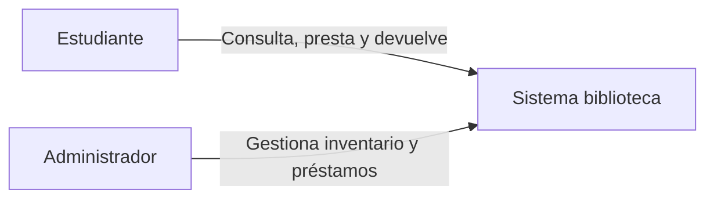
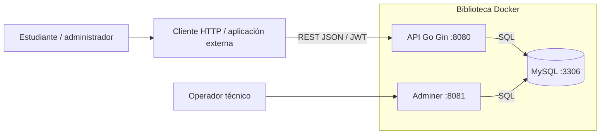
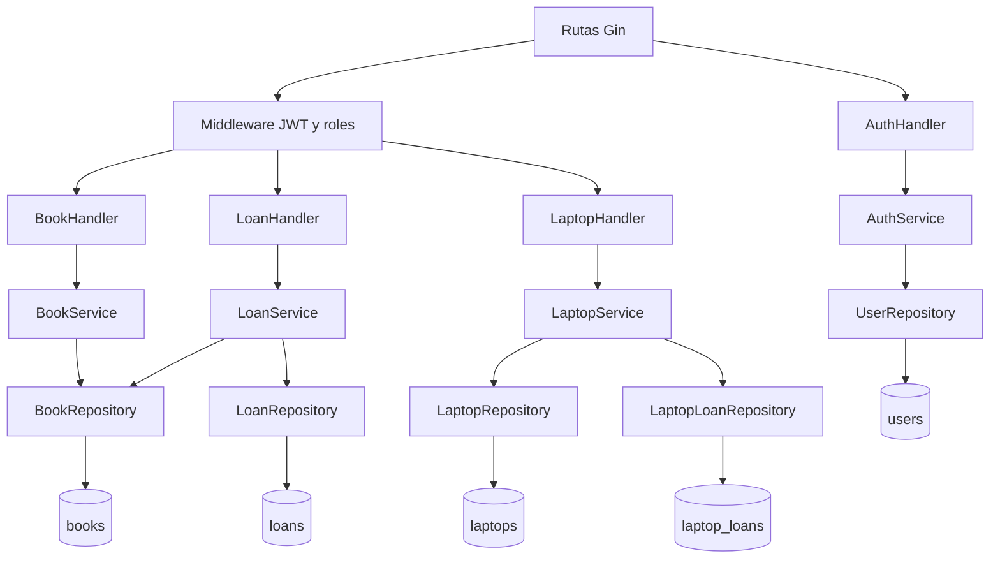
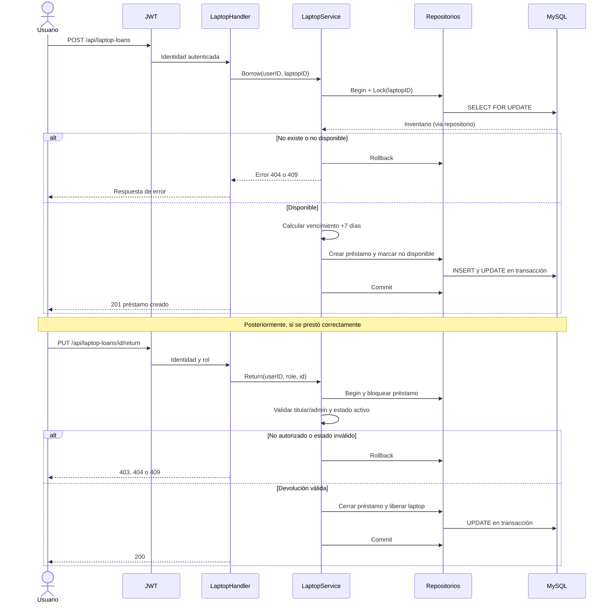

# Diagramas de arquitectura

## C4 nivel 1 — Contexto

```mermaid
flowchart LR
 S[Estudiante] -->|Consulta, presta y devuelve| B[Sistema biblioteca]
 A[Administrador] -->|Gestiona inventario y préstamos| B
```

## C4 nivel 2 — Contenedores

```mermaid
flowchart LR
 U[Estudiante / administrador] --> C[Cliente HTTP / aplicación externa]
 C -->|REST JSON / JWT| API[API Go Gin :8080]
 subgraph Biblioteca Docker
 API -->|SQL| DB[(MySQL :3306)]
 AD[Adminer :8081] -->|SQL| DB
 end
 T[Operador técnico] --> AD
```

## Componentes de la API

```mermaid
flowchart TB
 R[Rutas Gin] --> AU[AuthHandler]
 R --> JWT[Middleware JWT y roles]
 JWT --> BH[BookHandler]
 JWT --> LH[LoanHandler]
 JWT --> TH[LaptopHandler]
 AU --> AS[AuthService]
 AS --> UR[UserRepository]
 BH --> BS[BookService]
 BS --> BR[BookRepository]
 LH --> LS[LoanService]
 LS --> BR
 LS --> LR[LoanRepository]
 TH --> TS[LaptopService]
 TS --> TR[LaptopRepository]
 TS --> TL[LaptopLoanRepository]
 UR --> U[(users)]
 BR --> B[(books)]
 LR --> L[(loans)]
 TR --> I[(laptops)]
 TL --> P[(laptop_loans)]
```

## Secuencia — préstamo y devolución posterior

```mermaid
sequenceDiagram
 actor U as Usuario
 participant J as JWT
 participant H as LaptopHandler
 participant S as LaptopService
 participant R as Repositorios
 participant D as MySQL
 U->>J: POST /api/laptop-loans
 J->>H: Identidad autenticada
 H->>S: Borrow(userID, laptopID)
 S->>R: Begin + Lock(laptopID)
 R->>D: SELECT FOR UPDATE
 D-->>S: Inventario (via repositorio)
 alt No existe o no disponible
 S->>R: Rollback
 S-->>H: Error 404 o 409
 H-->>U: Respuesta de error
 else Disponible
 S->>S: Calcular vencimiento +7 días
 S->>R: Crear préstamo y marcar no disponible
 R->>D: INSERT y UPDATE en transacción
 S->>R: Commit
 H-->>U: 201 préstamo creado
 end
 Note over U,D: Posteriormente, si se prestó correctamente
 U->>J: PUT /api/laptop-loans/id/return
 J->>H: Identidad y rol
 H->>S: Return(userID, role, id)
 S->>R: Begin y bloquear préstamo
 S->>S: Validar titular/admin y estado activo
 alt No autorizado o estado inválido
 S->>R: Rollback
 H-->>U: 403, 404 o 409
 else Devolución válida
 S->>R: Cerrar préstamo y liberar laptop
 R->>D: UPDATE en transacción
 S->>R: Commit
 H-->>U: 200
 end
```
